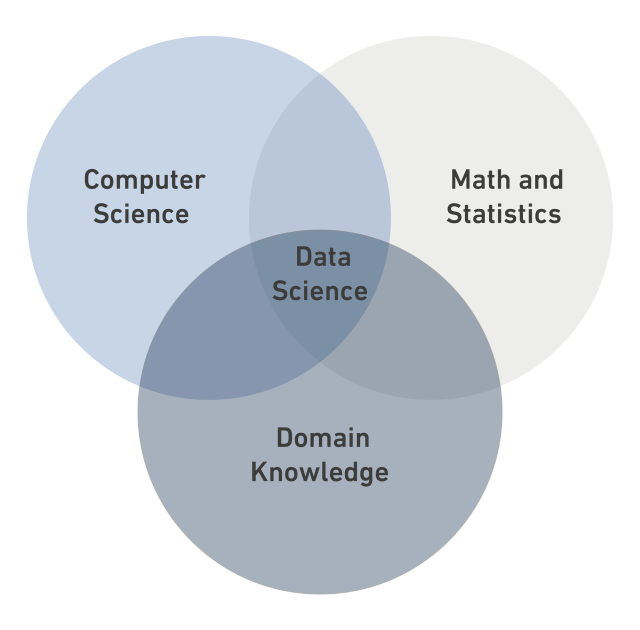

# Data Science

## What is Data Science?

*Data Science* is a  *multidisciplinary field* that combines statistics, computer science, and domain knowledge.



### Data Types: 
- Structured Data
- Semi-Structured Data
- Unstructured Data


```python
print("DS Bootcamp")
```
<a href="https://en.wikipedia.org/wiki/Data_science" style="text-decoration:none;"> Read more</a>
